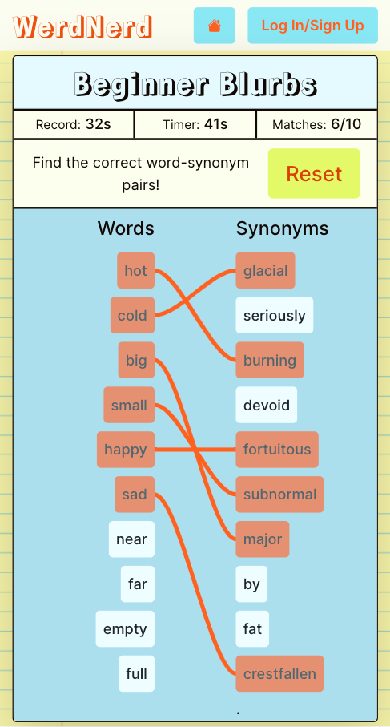
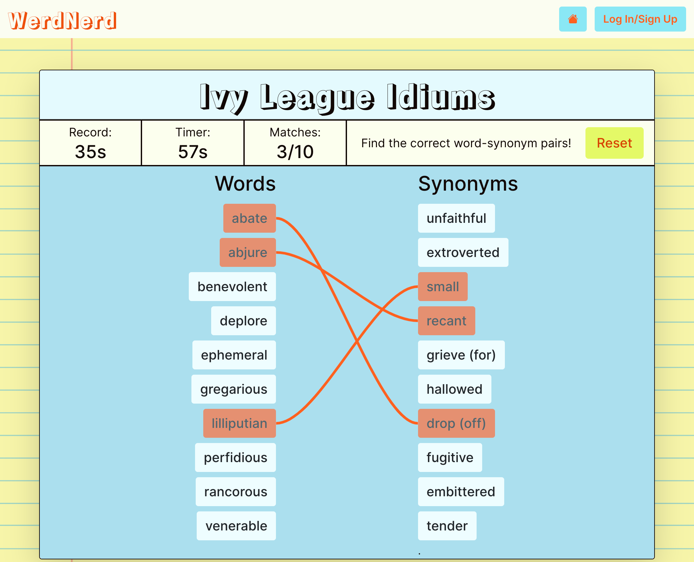

# WerdNerd

See the [deployed app](https://werd-nerd.herokuapp.com/)

[Link](https://github.com/BluejayTay/word_app_rails) to Ruby on Rails backend/API

#

## About

WerdNerd is an app that uses Merriam-Webster&apos;s Collegiate® Thesaurus API to create word-matching games for developing one’s vocabulary. Users can utilize pre-assembled word-lists for their games, or create their own if they are logged-in. Each game pulls randomly-selected synonyms for each word in it&apos;s word-list, so that every game with a given word-list is different!

How to play:

<ol>
  <li>
    Select a list to use for your game from the drop-down selection below.
  </li>
  <li>Press the &quot;Play&quot; button to load the game.</li>
  <li>
    Press &quot;Start&quot; to reveal the randomly-selected synonyms and
    start the clock!
  </li>
  <li>
    Match each word to their synonym by selecting the word on the left and
    their synonym on the right. A correct match will be revealed with an
    orange line connecting them together!
  </li>
  <li>
    Once you&apos;ve found all the matches, the timer stops and saves your
    time if you beat the record.
  </li>
</ol>

Built with:

- Ruby on Rails
- React
- JWT authorization
- PostgreSQL
- HTML, CSS, BootStrap
- Merriam-Webster&apos;s Collegiate® Thesaurus API

#

## Screenshot-Mobile

## Screenshot-Desktop

#

## Future Enhancements

- Add a "study" feature to allow users to study definitiions for words in their word-lists.
- Add feature that lets suggests similarly spelled words if a given word is not in the thesaurus or is misspelled.
- Add ability to post initials for highscores for the orginal WerdNerd word-lists.
