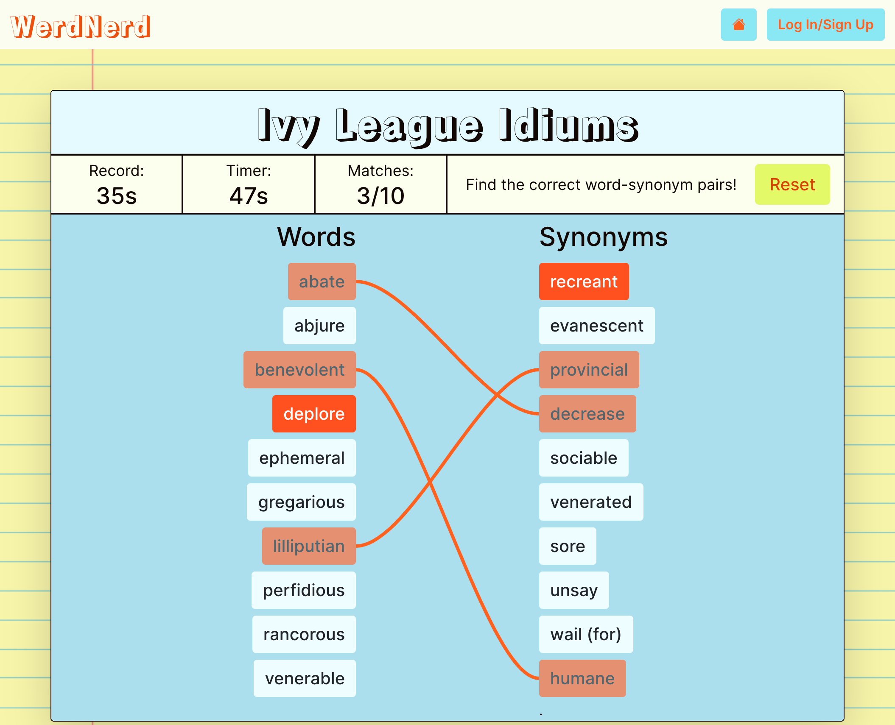

# WerdNerd

See the [deployed app](https://werd-nerd.herokuapp.com/)

[Link](https://github.com/BluejayTay/word_app_rails) to Ruby on Rails backend/API

#

## About

WerdNerd is an app that uses Merriam-Webster&apos;s Collegiate® Thesaurus API to create word-matching games for developing one’s vocabulary. Users can utilize pre-assembled word-lists for their games, or create their own if they are logged-in. Each game pulls randomly-selected synonyms for each word in it&apos;s word-list, so that every game with a given word-list is different!

Built with:

- Ruby on Rails
- React.js
- JWT authorization
- PostgreSQL
- HTML, CSS, BootStrap
- Merriam-Webster&apos;s Collegiate® Thesaurus API
- Deployed with Heroku

#

## Screenshot-Mobile

<p align="center">

</p>

## Screenshot-Desktop

<p align="center">

</p>

#

#

## Getting Started

### Running natively (You will need to sign up for an API key for Merriam Webster's Thesaurus API at [link](https://www.dictionaryapi.com/)<br>

1.) Clone both the [rails backend/API](https://github.com/BluejayTay/word_app_rails) and react frontend/client repos

2.) Make sure your ruby environment is at least 2.7.4

```
ruby --version
```

3.) Make sure your node version is at least 16.13.0

```
node --version
```

4.) bundle install <br>

in rails folder:

```
gem install bundle
bundle install
```

5.) npm install <br>

in react folder:

```
npm install
```

6.) Set up the environmental variable for your unique Merriam Webster's Thesaurus API key in the untracked application.yml file created from the figaro gem.(MW_thesaurus_api_key: '(your_key_here)')

7.) Create, migrate, and seed databases <br>

in rails folder:

```
rails db:create
rails db:migrate
rails db:seed
```

8.) Start the development server <br>

in rails folder:

```
rails s
```

in react folder:

```
npm start
```

Answer "y" to the prompt re: opening the app on localhost:3001 (since localhost:3000 is already being used by the rails backend).

9.) Navigate to localhost:3001 in your browser

#

## Future Enhancements

- Add a "study" feature to allow users to study definitiions for words in their word-lists.
- Add feature that lets suggests similarly spelled words to use instead if a given word is not in the thesaurus or is misspelled.
- Add ability to post initials for highscores for the orginal WerdNerd word-lists.
